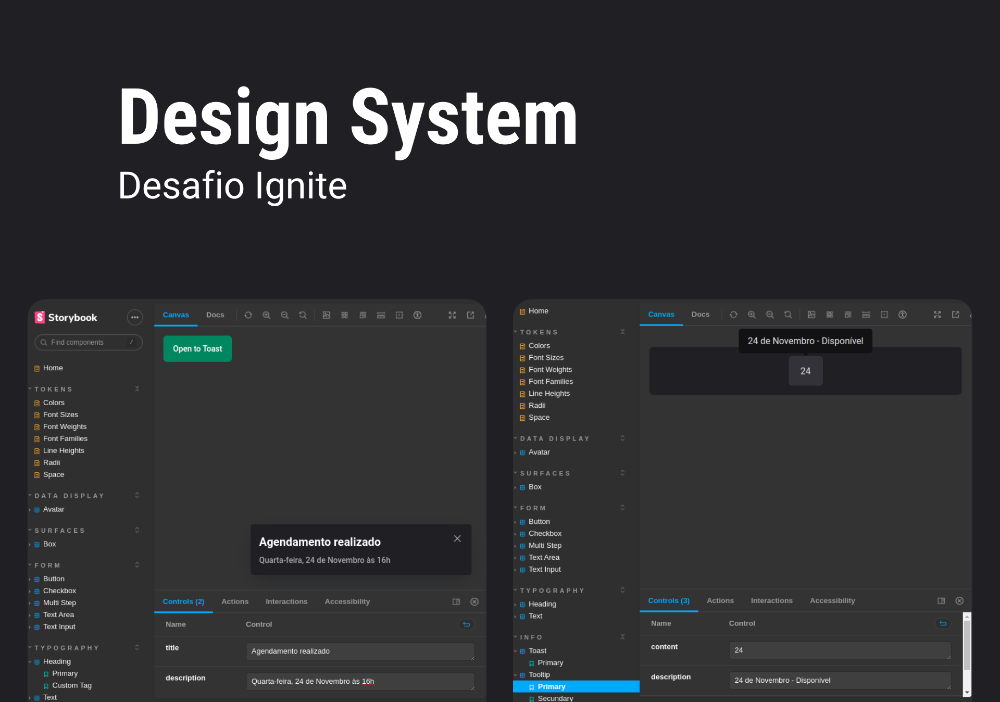

<h1 align="center">
  
</h1>

## Components

- [x] Text
- [x] Heading
- [x] Box
- [x] Button
- [x] TextInput
- [x] TextArea
- [x] Checkbox
- [x] Avatar
- [x] MultiStep
- [x] Tooltip
- [x] Toast

---

## 🛠 Tecnologias
As seguintes ferramentas foram usadas na construção do projeto:

-   **[Radix UI / React Avatar](https://www.radix-ui.com/docs/primitives/components/avatar)**
-   **[Radix UI / React Checkbox](https://www.radix-ui.com/docs/primitives/components/checkbox)**
-   **[Radix UI / React Toast](https://www.radix-ui.com/docs/primitives/components/toast)**
-   **[Radix UI / React Tooltip](https://www.radix-ui.com/docs/primitives/components/tooltip)**
-   **[Stitches / React](https://stitches.dev/docs/installation)**
-   **[Phosphor React](https://phosphoricons.com/)**
-   **[Typescript](https://www.npmjs.com/package/typescript?activeTab=versions)**
-   **[Storybook](https://storybook.js.org/)**
-   **[Polished](https://www.npmjs.com/package/polished)**
-   **[Turbo](https://www.npmjs.com/package/turbo)**
-   **[Changesets](https://www.npmjs.com/package/@changesets/cli)**
-   **[Rocketseat / Eslint Config](https://github.com/Rocketseat/eslint-config-rocketseat)**

## 🦸 Autor

  
 <b>Everton Schultz</b></a>
  

## License
Este projeto pode ser usado por qualquer pessoa! Licença MIT